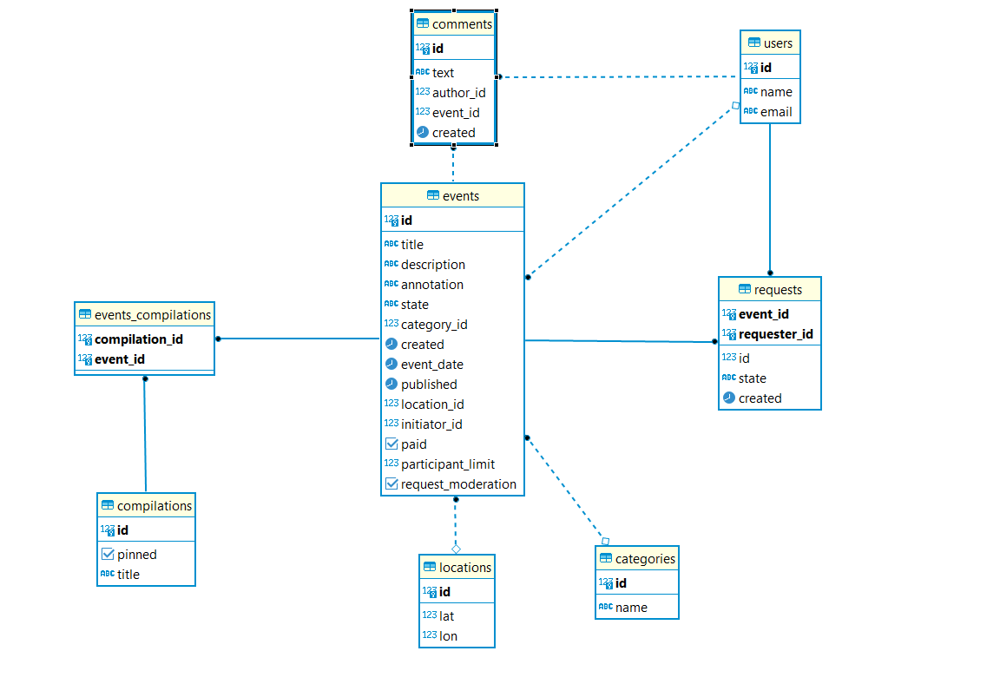

# ExploreWithMe 
#### ExploreWithMe is a backend application built on a microservices architecture, serving the purpose of creating event schedules and participating in them.

## Stack:
#### JAVA 11, REST, JPA, Maven, Spring-Boot, Hibernate, PostgresSQL и H2, Docker

## Features:
- Three levels of access (public/private/admin)
- Database of unique users
- Database of events (creation/update) with a limit on user participation
- Event moderation by admin (publishing/cancellation)
- User requests to participate in events
- Creation of special event collections
- Ability to comment on events

## Main Service Database Structure:

